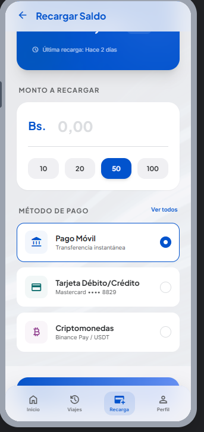
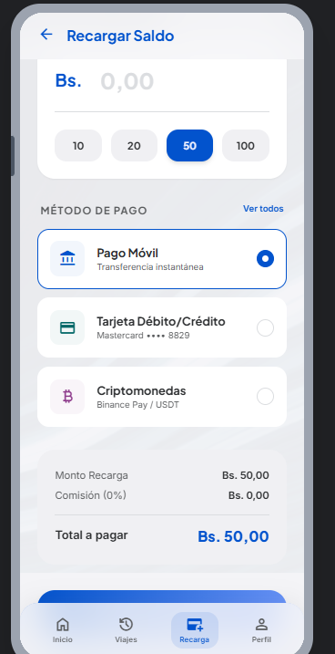
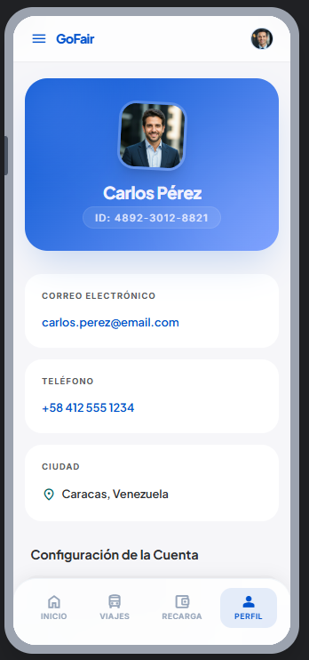

# GoFare - Mobile App 🚌

Una aplicación móvil moderna y fluida para la gestión de viajes y recargas de saldo en transporte público.

## 🚀 Cómo correr la app

Este proyecto utiliza **Expo** y **Expo Router**.

1.  **Clonar y entrar:**
    ```bash
    git clone https://github.com/Rafa-afkdev/GoFare.git
    cd GoFare
    ```
2.  **Instalar dependencias:**
    ```bash
    npm install
    ```
3.  **Iniciar el proyecto:**
    ```bash
    npx expo start
    ```
4.  **Ver en el móvil:**
    Escanea el código QR con la app **Expo Go** (Android/iOS).

---

## 🧾 Commits y Changelog

Este repo usa **Conventional Commits** con `commitizen` y genera `CHANGELOG.md` con `standard-version`.

- Commit guiado:

```bash
npm run commit
```

- Generar changelog / release:

```bash
npm run release
```

Más detalles en `DEVELOPING.md`.

---

## 🛠 Decisiones Técnicas y Limitaciones

### Decisiones:
- **Expo Router:** Se eligió para un manejo de navegación basado en archivos, similar a Next.js, facilitando la escalabilidad.
- **Tokens de Diseño:** Se implementó un sistema de tokens en `src/theme/tokens.ts` para centralizar colores y tipografía, permitiendo cambios globales instantáneos.
- **Expo Camera:** Integración nativa para el escaneo de códigos QR en la pantalla de pago de viajes.
- **Diseño Premium:** Uso de gradientes (`LinearGradient`), desenfoques y sombras dinámicas para lograr una estética moderna y profesional.

### Limitaciones:
- **Mock Data:** Actualmente, la información de saldo, viajes y rutas es estática.
- **Autenticación:** La pantalla de login es visual; no cuenta con integración real a un backend.
- **Persistencia:** No se ha implementado almacenamiento local (SQLite/AsyncStorage) para el estado del usuario entre sesiones.

---

## 📸 Capturas de Pantalla

| Inicio | Recarga | Perfil |
| :---: | :---: | :---: |
|  |  |  |

---

Desarrollado con ❤️ para GoFare.
